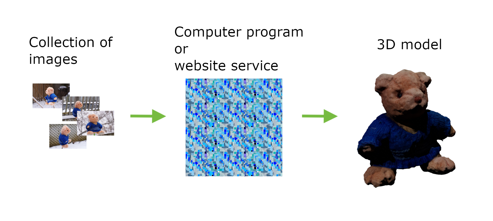

# Project Name  PhotoTestSet

## Description

A collection of images for photogrammetry that have been successfully processed with Meshroom, Scanamaze, and PhotoCatch. 

PhotogrammetryDemoMakerspace.pdf is a summary doc for a talk we did in Georgian's MakerSpace, E212 Barrie Campus.

PhotogrammetryDemoWithGeorge.pdf is a similar summary doc for a talk for George's students at Ross St campus.

## Usage
Clone the project, or download the zip'ed prroject, to a local directory. 

